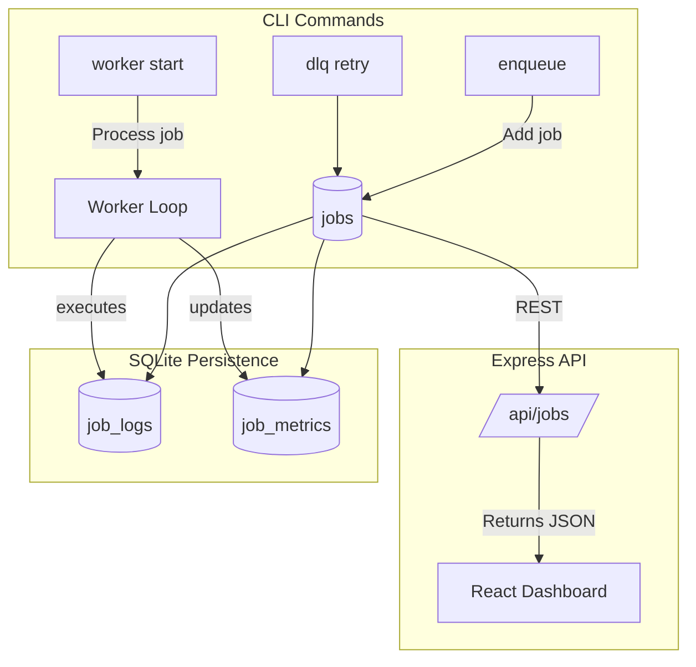
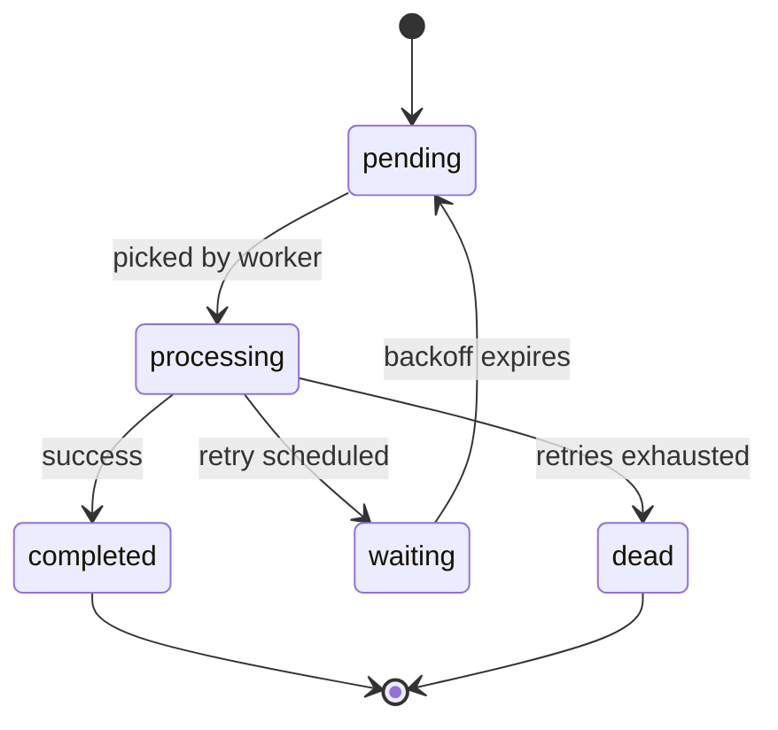

<h1 align="center">🚀 QueueCTL — Lightweight Node.js Job Queue System</h1>

<p align="center">
  
  
  
</p>

<p align="center">
  
</p>

---

## ⚙️ **Setup & Installation**

### 🧩 Clone the repository
```bash
git clone https://github.com/<your-username>/queuectl.git
cd queuectl
```

### 📦 Install dependencies
```bash
npm install
```

### ▶️ Start the backend server
```bash
node app.js
```

### 💻 Start the frontend dashboard
```bash
cd dashboard
npm install
npm run dev
```
Visit 👉 **http://localhost:5173**

### 🧠 Use the CLI globally
```bash
npm link
queuectl --help
```

---

## 💡 **Usage Examples**

### ✅ Enqueue a job
```bash
queuectl enqueue '{"command":"echo Hello Queue"}'
```

### 🧵 Start workers
```bash
queuectl worker start -c 3
```

### 📋 List jobs
```bash
queuectl list
```

### 🪦 Manage Dead Letter Queue
```bash
queuectl dlq list
queuectl dlq retry
queuectl dlq clear
```

### ⚙️ Configure queue behavior
```bash
queuectl config set max_retries 5
queuectl config set backoff_base 3
queuectl config get job_timeout
```

---

## 🧱 **Architecture Overview**



---

## ⚙️ **Job Lifecycle**



---

## 🧩 **Core Components**

| File | Description |
|------|--------------|
| `db.js` | SQLite3 schema and migrations |
| `queue.js` | Handles enqueue, DLQ, retries, waiting state |
| `worker.js` | Worker lifecycle, metrics, retries |
| `cli.js` | CLI management tool |
| `config.js` | Persistent runtime configs |
| `dashboard/` | React + Tailwind + Framer Motion dashboard |

---

## 🧠 **Architecture Highlights**

- 💾 SQLite-backed persistence  
- 🔁 Retry mechanism with exponential backoff  
- 🪦 Dead Letter Queue for failed jobs  
- 🧠 Automatic job reactivation  
- 🧰 Persistent logs and metrics  
- 🎨 Dashboard with animations and live refresh  

---

## 📊 **Dashboard Features**

- Realtime job monitoring  
- Scrollable job table (sticky header)  
- Hover effects & animations  
- Auto-refresh toggle + manual refresh  
- State icons:  
  ⏳ *Pending* | 🔄 *Processing* | ⏸ *Waiting* | ⚠️ *Failed* | 💀 *Dead* | ✅ *Completed*  

---

## 🧪 **Testing Instructions**

### 1️⃣ Enqueue jobs
```bash
queuectl enqueue '{"command":"sleep 2 && echo Done"}'
```

### 2️⃣ Start workers
```bash
queuectl worker start -c 2
```

### 3️⃣ Verify dashboard
Visit **http://localhost:5173**

✅ Observe live transitions → Pending → Processing → Completed  
🌀 Processing state spins  
💀 Dead + ⏸ Waiting appear dynamically  

### 4️⃣ Test DLQ behavior
```bash
queuectl enqueue '{"command":"false"}'
queuectl dlq list
queuectl dlq retry
```

---

## ⚖️ **Assumptions & Design Choices**

| Category | Choice | Reason |
|-----------|---------|--------|
| DB | SQLite3 | Lightweight and persistent |
| Retries | Exponential | Prevents quick re-fail loops |
| DLQ | Dedicated `dead` state | Safe manual recovery |
| Config | Stored in DB | CLI controlled |
| Workers | In-process | Simpler lifecycle |
| Dashboard | Poll-based | Stable real-time UX |

---

## 🧰 **Developer Commands**

| Command | Description |
|----------|-------------|
| `queuectl enqueue <json>` | Add a new job |
| `queuectl list` | List all jobs |
| `queuectl worker start -c N` | Start N workers |
| `queuectl dlq list` | List DLQ jobs |
| `queuectl dlq retry` | Retry DLQ jobs |
| `queuectl logs <id>` | View logs for a job |
| `queuectl metrics` | Show job metrics |
| `queuectl config set key value` | Change runtime config |

---

## 🧩 **Test Samples**

| Type | Command | Expected Result |
|------|----------|-----------------|
| Success | `queuectl enqueue '{"command":"echo Hello"}'` | ✅ Completed |
| Retry | `queuectl enqueue '{"command":"false"}'` | 🔁 Retries → Dead |
| Long Job | `queuectl enqueue '{"command":"sleep 5 && echo Done"}'` | 🕐 Processing |
| Scheduled | `queuectl enqueue '{"command":"echo Future","run_at":"2025-11-09T18:00:00"}'` | ⏰ Scheduled |

---

## 📈 **Performance Metrics**

| Metric | Description |
|---------|-------------|
| `total_jobs` | Unique job count |
| `completed` | Finished successfully |
| `failed` | Failed attempts |
| `waiting` | Waiting for retry |
| `dead` | Permanently failed |
| `avg_duration` | Avg job duration |

---

## 🖥️ **Dashboard Preview**

<p align="center">
  
</p>

---

## 🧡 **Built With**

- ⚙️ Node.js + Express  
- 💾 SQLite3  
- 🧠 CLI (yargs + chalk + cli-table3)  
- 🎨 React + TailwindCSS + Framer Motion  

---

## 💬 **Contributing**

1. Fork the repo 🍴 
2. Create a branch (`git checkout -b feature/new`)  
3. Commit your changes (`git commit -m "Added feature"`)  
4. Push (`git push origin feature/new`)  
5. Open a Pull Request 🚀  

---

<p align="center">
  
</p>
